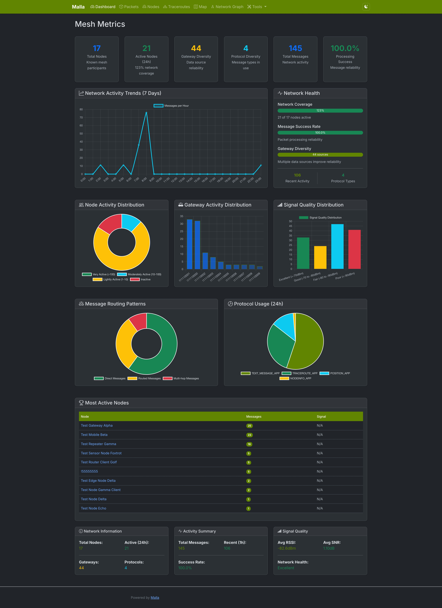
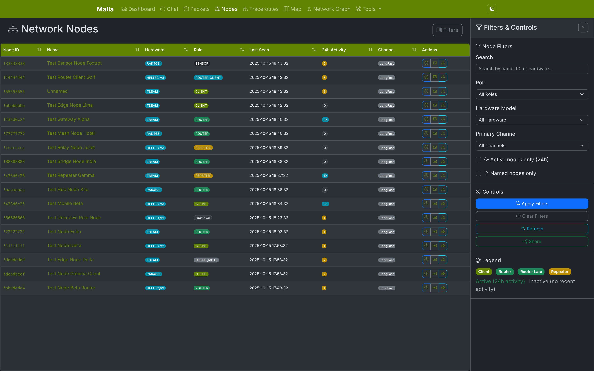
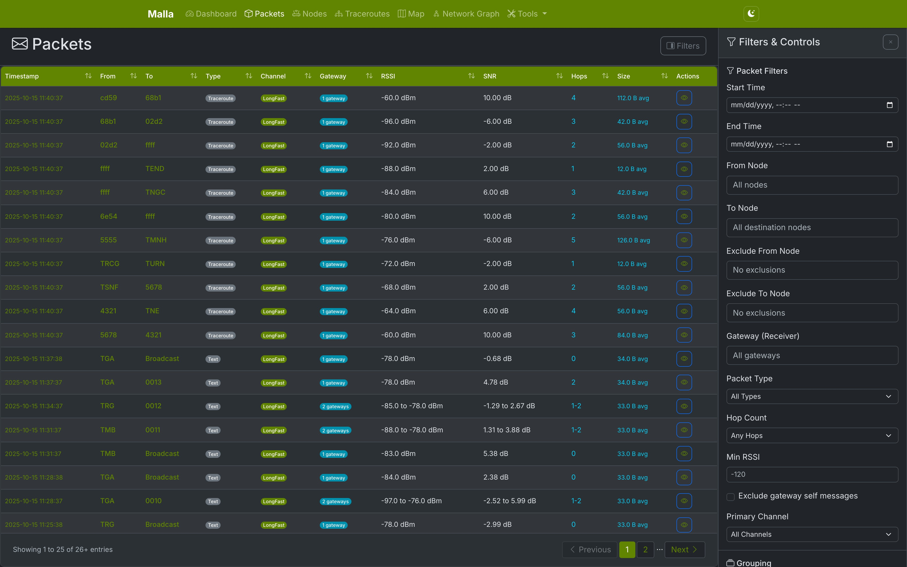
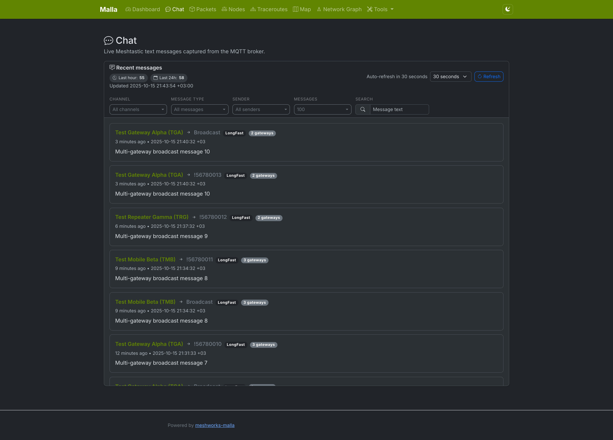
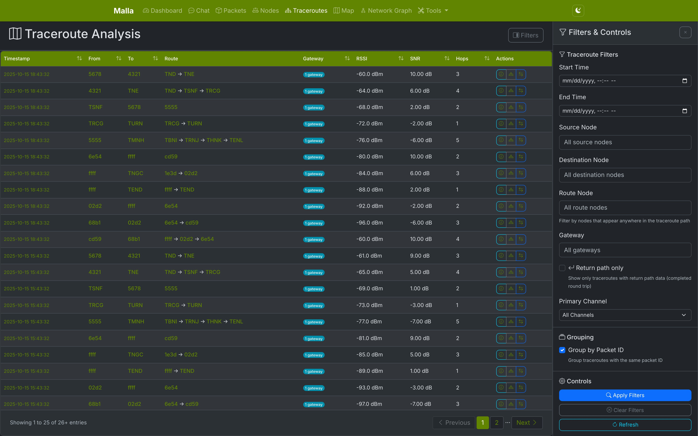
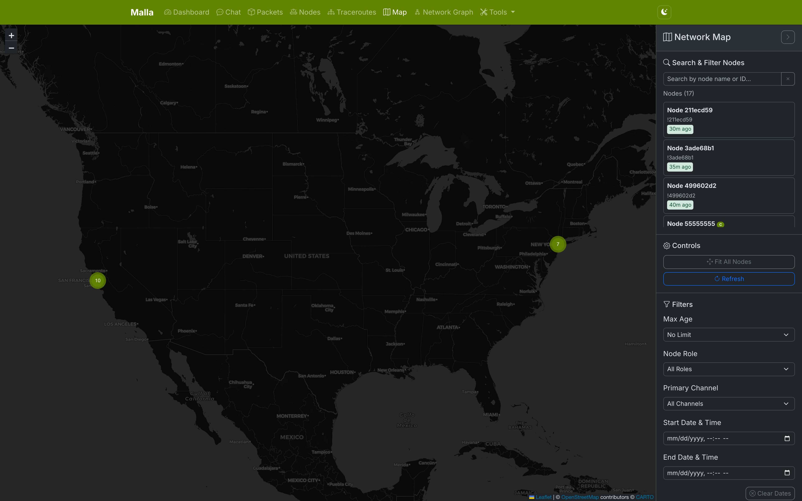
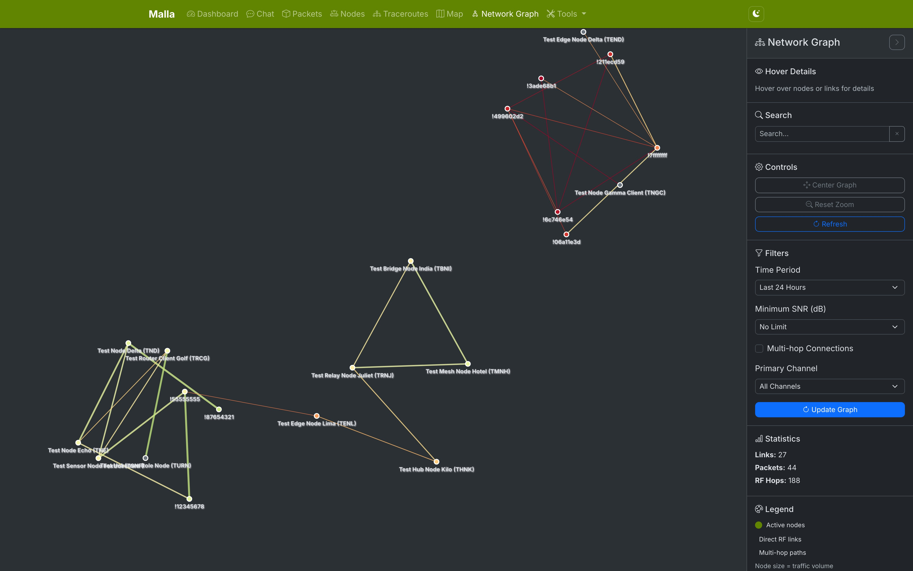
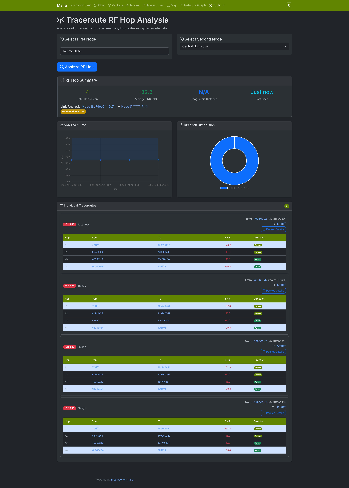
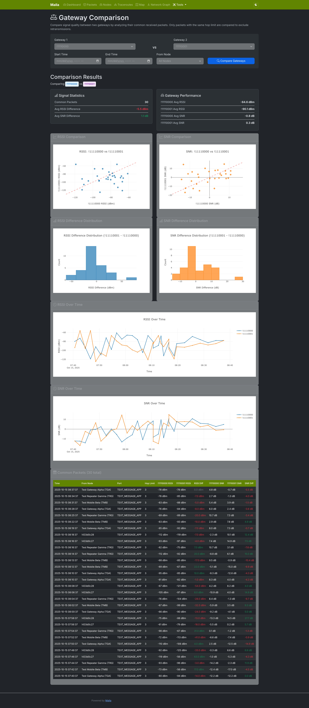
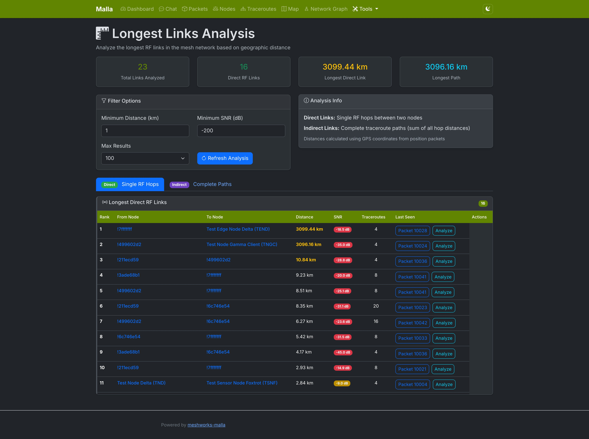

# MeshWorks Malla — Meshtastic analysis & web UI

MeshWorks Malla (_“mesh”_ in Spanish) ingests Meshtastic MQTT packets into SQLite and provides a modern web UI to explore packets, nodes, chat, traceroutes and maps. It’s suitable for personal networks, community deployments and experimentation.

Public Docker images live at **ghcr.io/aminovpavel/meshworks-malla**.

> Attribution: This project originated as a fork of [zenitraM/malla](https://github.com/zenitraM/malla). Many thanks to the upstream authors and community.

## Quick start

Pick whichever workflow fits you best:

- **Local development (recommended)**  
  ```bash
  git clone https://git.meshworks.ru/MeshWorks/meshworks-malla.git
  cd meshworks-malla
  curl -LsSf https://astral.sh/uv/install.sh | sh        # install uv (once)
  uv sync --dev                                         # install deps incl. Playwright tooling
  playwright install chromium --with-deps              # e2e/browser support (once per host)
  mkdir -p devdata
  docker run -d --name meshpipe-dev \\
    -e MESHPIPE_MQTT_BROKER_ADDRESS=meshtastic.taubetele.com \\
    -e MESHPIPE_MQTT_USERNAME=meshdev \\
    -e MESHPIPE_MQTT_PASSWORD=large4cats \\
    -e MESHPIPE_DATABASE_FILE=/data/meshtastic_history.db \\
    -v $(pwd)/devdata:/data \\
    ghcr.io/aminovpavel/meshpipe-go:latest meshpipe      # terminal 1 – capture (Go)
  uv run malla-web                                       # terminal 2 – web UI
  ```
  Prefer building the capture service yourself? Clone [aminovpavel/meshpipe-go](https://github.com/aminovpavel/meshpipe-go) and run `go run ./cmd/meshpipe` with the same `MESHPIPE_*` environment overrides.

- **Docker compose (deployment-style)**  
  ```bash
  git clone https://git.meshworks.ru/MeshWorks/meshworks-malla.git
  cd meshworks-malla
  cp ops/samples/env.example .env                      # fill in MQTT credentials
  docker pull ghcr.io/aminovpavel/meshworks-malla:latest
  docker pull ghcr.io/aminovpavel/meshpipe-go:latest
  export MALLA_IMAGE=ghcr.io/aminovpavel/meshworks-malla:latest
  export MESHPIPE_IMAGE=ghcr.io/aminovpavel/meshpipe-go:latest
  docker compose -f ops/compose/docker-compose.yml up -d
  ```
  `meshpipe` and `malla-web` share the volume `malla_data`, so captured history persists across restarts.

Need demo data, screenshots, maintainer workflows or release notes on the image pipeline? See [docs/development.md](docs/development.md).

### Configuration tips

Most settings live in `config.yaml`, but every option can be overridden with `MALLA_*` environment variables. A few recent ones you may want to toggle:

| Purpose | Env var | Default |
| --- | --- | --- |
| Open the web UI database in read-only mode | `MALLA_DATABASE_READ_ONLY` | `1` |
| Honour proxy-provided `X-Forwarded-*` headers | `MALLA_TRUST_PROXY_HEADERS` | `0` |
| Comma-separated host allowlist for inbound requests | `MALLA_ALLOWED_HOSTS` | _(empty)_ |
| Simple rate limiting rule (Flask-Limiter syntax) | `MALLA_DEFAULT_RATE_LIMIT` | _(empty)_ |
| Enable debugging endpoints/UI (dev only) | `MALLA_ENABLE_BROWSER_DEBUG` | `0` |
| Token required when debug UI is enabled | `MALLA_DEBUG_TOKEN` | _(unset)_ |
| Keep the default Leaflet attribution banner | `MALLA_MAP_SHOW_LEAFLET_BRANDING` | `0` |
| Persist raw MQTT payloads for later inspection | `MALLA_CAPTURE_STORE_RAW` | `1` |
| Enable Meshpipe gRPC backend (feature flag) | `MALLA_MESHPIPE_USE_GRPC` | `0` |
| Direct Meshpipe gRPC endpoint (`host:port`) | `MALLA_MESHPIPE_GRPC_ENDPOINT` | `127.0.0.1:7443` |
| Use the Envoy proxy instead of direct endpoint | `MALLA_MESHPIPE_GRPC_USE_PROXY` | `0` |
| Envoy proxy endpoint for gRPC/gRPC-Web | `MALLA_MESHPIPE_GRPC_PROXY_ENDPOINT` | `127.0.0.1:8443` |
| Bearer token sent with gRPC calls (optional) | `MALLA_MESHPIPE_GRPC_TOKEN` | _(unset)_ |
| Per-request gRPC timeout in seconds | `MALLA_MESHPIPE_GRPC_TIMEOUT_SECONDS` | `5.0` |

The [Development guide](docs/development.md#configuration-reference) has a full table, defaults, and additional context.

## Running instances

Community instances may run different versions; feature parity is not guaranteed.

## Highlights

- Fast packet browser with filters (time, node, RSSI/SNR, type) and CSV export
- Chat stream (TEXT_MESSAGE_APP) with sender/channel filters
- Node explorer (hardware, role, battery) with search & badges
- Traceroutes, map and network graph views
- Tools: hop analysis, gateway compare, longest links, analytics

## Features

### 🚀 Key Highlights

- **Capture & storage** – every MQTT packet lands in an optimized SQLite history.
- **Dashboard** – live counters, health indicators and auto-refresh cards.
- **Packets browser** – fast filters (time, node, RSSI/SNR, type) with CSV export.
- **Chat page** – rich `TEXT_MESSAGE_APP` stream with sender/channel filters.
- **Node explorer** – full hardware/role/battery view with search & status badges.
- **Traceroutes / map / network graph** – visualize paths, geography and topology.
- **Toolbox** – hop analysis, gateway comparison, longest links and more.
- **Analytics** – 7‑day trends, RSSI distribution, top talkers and hop stats.
- **Single config** – `config.yaml` (or `MALLA_*` env vars) drives both services.
- **One-command launch** – Meshpipe (Go capture) + Malla web via the bundled compose files.

<!-- screenshots:start -->










<!-- screenshots:end -->

## Repository layout

- `src/malla/web_ui.py` – Flask app factory, template filters and entrypoints.
- `src/malla/routes/` – HTTP routes (`main_routes.py` for UI pages, `api_routes.py` for JSON endpoints).
- `src/malla/database/` – connection helpers and repositories (includes the chat data access layer).
- `src/malla/templates/` – Jinja2 templates; `chat.html` contains the new chat interface.
- `src/malla/static/` – CSS/JS assets tailored for the Meshworks fork.
- `scripts/` – local tooling (`create_demo_database.py`, `generate_screenshots.py`).
- `bin/` – helper entrypoints for running capture/web locally without installation.
- `ops/` – Compose bundles and sample config/env files for Docker deployments.
- `tests/` – unit, integration and Playwright e2e suites.
- `.screenshots/` – auto-generated images embedded in this README.

## Prerequisites

- Python 3.13+ (when running locally with `uv`)
- Docker 24+ (if you prefer containers)
- Access to a Meshtastic MQTT broker
- Modern web browser with JavaScript enabled

## Installation

### Using Docker (public image)

Public images are available on GHCR: `ghcr.io/aminovpavel/meshworks-malla` with tags like `latest` and `sha-<shortsha>` (commit-based).

```bash
docker pull ghcr.io/aminovpavel/meshworks-malla:latest
# or pin a specific build
docker pull ghcr.io/aminovpavel/meshworks-malla:sha-be66ef8

# Run capture (MQTT -> SQLite) with Meshpipe
docker volume create malla_data
docker run -d --name meshpipe \"
  -e MESHPIPE_MQTT_BROKER_ADDRESS=your.mqtt.broker.address \"
  -e MESHPIPE_MQTT_PORT=1883 \"
  -e MESHPIPE_MQTT_USERNAME=your_user \"
  -e MESHPIPE_MQTT_PASSWORD=your_pass \"
  -e MESHPIPE_DATABASE_FILE=/data/meshtastic_history.db \"
  -v malla_data:/data \"
  ghcr.io/aminovpavel/meshpipe-go:latest \"
  meshpipe

# Run Web UI only (binds 5008)
docker run -d --name malla-web \
  -p 5008:5008 \
  -e MALLA_DATABASE_FILE=/app/data/meshtastic_history.db \
  -e MALLA_HOST=0.0.0.0 \
  -e MALLA_PORT=5008 \
  -v malla_data:/app/data \
  ghcr.io/aminovpavel/meshworks-malla:sha-be66ef8 \
  /app/.venv/bin/malla-web-gunicorn
```

To force-refresh browser caches for static assets, set `MALLA_STATIC_VERSION` (typically the short SHA of the image):

```bash
docker run -d --name malla-web \
  -p 5008:5008 \
  -e MALLA_DATABASE_FILE=/app/data/meshtastic_history.db \
  -e MALLA_HOST=0.0.0.0 \
  -e MALLA_PORT=5008 \
  -e MALLA_STATIC_VERSION=be66ef8 \
  -v malla_data:/app/data \
  ghcr.io/aminovpavel/meshworks-malla:sha-be66ef8 \
  /app/.venv/bin/malla-web
```

### Using Docker (build locally)

You can also build an image locally and point Docker Compose at the result.

```bash
git clone https://git.meshworks.ru/MeshWorks/meshworks-malla.git
cd meshworks-malla
cp ops/samples/env.example .env                      # fill in MQTT credentials
$EDITOR .env
docker build -t meshworks/malla:local .  # add --platform for multi-arch
export MALLA_IMAGE=meshworks/malla:local
docker compose -f ops/compose/docker-compose.yml up -d
docker compose -f ops/compose/docker-compose.yml logs -f  # watch containers
```
The compose file ships with a capture + web pair already wired to share `malla_data` volume.

### Image tags

- `latest` – moving tag following the default branch
- `sha-<shortsha>` – immutable commit-based pins (recommended for production)
- Semver `vX.Y.Z` (when releases are cut), plus `X.Y`

**Manual Docker run (advanced):**
```bash
# Shared volume for the SQLite database
docker volume create malla_data

# Capture worker (Meshpipe Go)
docker run -d --name meshpipe \
  -e MESHPIPE_MQTT_BROKER_ADDRESS=your.mqtt.broker.address \
  -e MESHPIPE_DATABASE_FILE=/data/meshtastic_history.db \
  -v malla_data:/data \
  ghcr.io/aminovpavel/meshpipe-go:latest \
  meshpipe

# Web UI
docker run -d --name malla-web \
  -p 5008:5008 \
  -e MALLA_DATABASE_FILE=/app/data/meshtastic_history.db \
  -e MALLA_HOST=0.0.0.0 \
  -e MALLA_PORT=5008 \
  -v malla_data:/app/data \
  meshworks/malla:local \
  /app/.venv/bin/malla-web
```

### Using uv

You can also install and run this fork directly using [uv](https://docs.astral.sh/uv/):
1. **Clone the repository** (Meshworks fork):
   ```bash
   git clone https://git.meshworks.ru/MeshWorks/meshworks-malla.git
   cd meshworks-malla
   ```

2. **Install uv** if you do not have it yet:
   ```bash
   curl -LsSf https://astral.sh/uv/install.sh | sh
   ```

3. **Create a configuration file** by copying the sample file:
   ```bash
   cp ops/samples/config.sample.yaml config.yaml
   $EDITOR config.yaml  # tweak values as desired
   ```

4. **Install dependencies** (development extras recommended):
   ```bash
   uv sync --dev
   playwright install chromium --with-deps
   ```

5. **Run capture + web.** Meshpipe (the Go capture service) writes the SQLite database; Malla serves the UI on port 5008.
   ```bash
   docker run -d --name meshpipe-dev \
     -e MESHPIPE_MQTT_BROKER_ADDRESS=meshtastic.taubetele.com \
     -e MESHPIPE_MQTT_USERNAME=meshdev \
     -e MESHPIPE_MQTT_PASSWORD=large4cats \
     -e MESHPIPE_DATABASE_FILE=/data/meshtastic_history.db \
     -v $(pwd)/devdata:/data \
     ghcr.io/aminovpavel/meshpipe-go:latest meshpipe

   uv run malla-web
   ```
   Prefer building the capture binary locally? Clone [aminovpavel/meshpipe-go](https://github.com/aminovpavel/meshpipe-go) and run `go run ./cmd/meshpipe` with the same `MESHPIPE_*` environment overrides.

### Using Nix
### Using Nix
The project also comes with a Nix flake and a devshell - if you have Nix installed or run NixOS it will set up
`uv` for you together with the exact system dependencies that run on CI (Playwright, etc.):

```bash
nix develop --command uv run malla-web
# Start Meshpipe separately (container or go run ./cmd/meshpipe)
```

## Core components overview

The system consists of two components that work together:

### 1. Meshpipe (Go capture)

Meshpipe replaces the legacy Python capture. It listens to your Meshtastic MQTT broker, decrypts payloads, and persists packets + node metadata to SQLite. Configure it via `MESHPIPE_*` env vars (or a YAML file – see the [Meshpipe README](https://github.com/aminovpavel/meshpipe-go)).

```yaml
MESHPIPE_MQTT_BROKER_ADDRESS: "your.mqtt.broker.address"
MESHPIPE_MQTT_TOPIC_PREFIX: "msh"
MESHPIPE_MQTT_TOPIC_SUFFIX: "/+/+/+/#"
```

Run it using the published container:

```bash
docker run -d --name meshpipe \
  -e MESHPIPE_MQTT_BROKER_ADDRESS=your.mqtt.broker.address \
  -e MESHPIPE_DATABASE_FILE=/data/meshtastic_history.db \
  -v malla_data:/data \
  ghcr.io/aminovpavel/meshpipe-go:latest meshpipe
```

> Meshpipe still honours the old `MALLA_*` variables for backwards compatibility, but new deployments should prefer the `MESHPIPE_*` names.

### 2. Web UI

The web interface for browsing and analyzing the captured data.

**Start the web UI:**
```bash
uv run malla-web
```

**Access the web interface:**
- Local: http://localhost:5008

### Health & info endpoints

- `GET /health` – returns `{ status, service, version }` (used by CI smoke tests)
- `GET /info` – returns application metadata (name, version, components)

## Running Both Tools Together

For a complete deployment you need Meshpipe (capture) and Malla (web). They share the same SQLite volume.

**Terminal / container 1 – Meshpipe (capture):**
```bash
# container-based quick start
docker run -d --name meshpipe \
  -e MESHPIPE_MQTT_BROKER_ADDRESS=your.mqtt.broker.address \
  -e MESHPIPE_DATABASE_FILE=/data/meshtastic_history.db \
  -v malla_data:/data \
  ghcr.io/aminovpavel/meshpipe-go:latest meshpipe
# or build from source: go run ./cmd/meshpipe (see meshpipe-go repo)
```

**Terminal 2 – web UI:**
```bash
uv run malla-web
# or:
./bin/malla-web
```

Both services read/write the same SQLite database. Meshpipe uses WAL-friendly writes; the Flask app opens the database in read-only mode by default to avoid lock contention.

## Static assets & favicon

### Cache-busting

Static URLs are versioned with a `?v=STATIC_VERSION` query param in templates. The value resolves to:

- `MALLA_STATIC_VERSION` env var, if set (e.g., `be66ef8`).
- Otherwise, the Python package version from `src/malla/__init__.py`.

This lets you force-refresh client caches without modifying code by setting the env var in Docker/Compose.

### Favicon

- Place your icon at `src/malla/static/icons/favicon.ico`.
- The app serves `/favicon.ico` directly. If `src/malla/static/icons/favicon.png` exists, it will be used as a fallback when ICO is missing.

## Further reading

- [Development guide](docs/development.md) – demo database tooling, detailed testing matrix, Docker production tips, configuration reference and the full pre-push checklist.
## Contributing

Feel free to submit issues, feature requests, or pull requests to improve Malla!

## License

This project is licensed under the [MIT](LICENSE) license.
