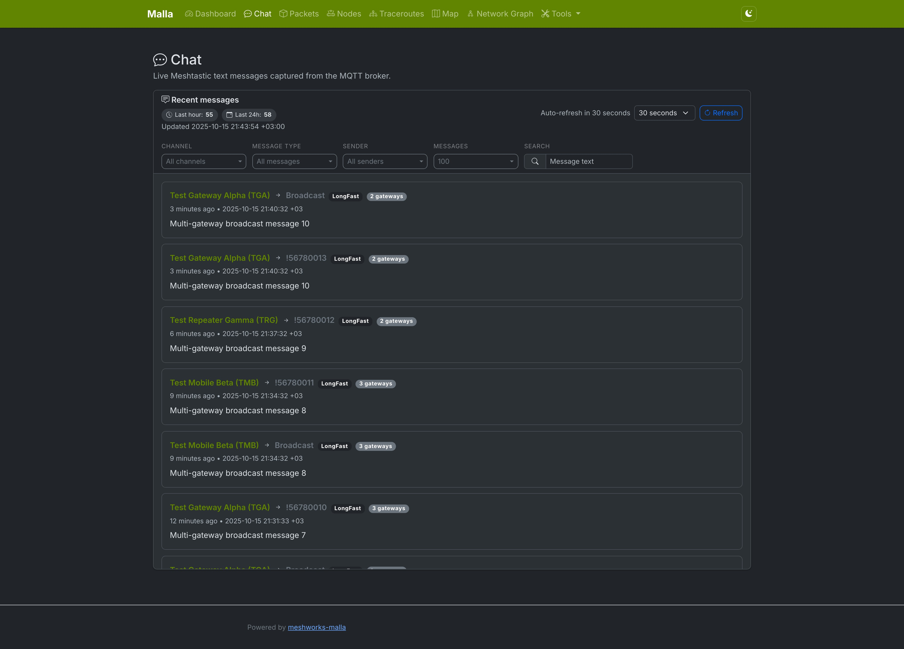
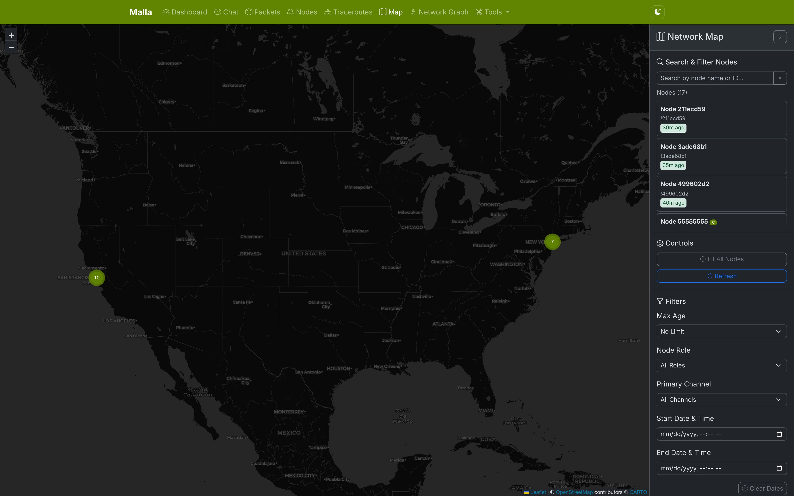
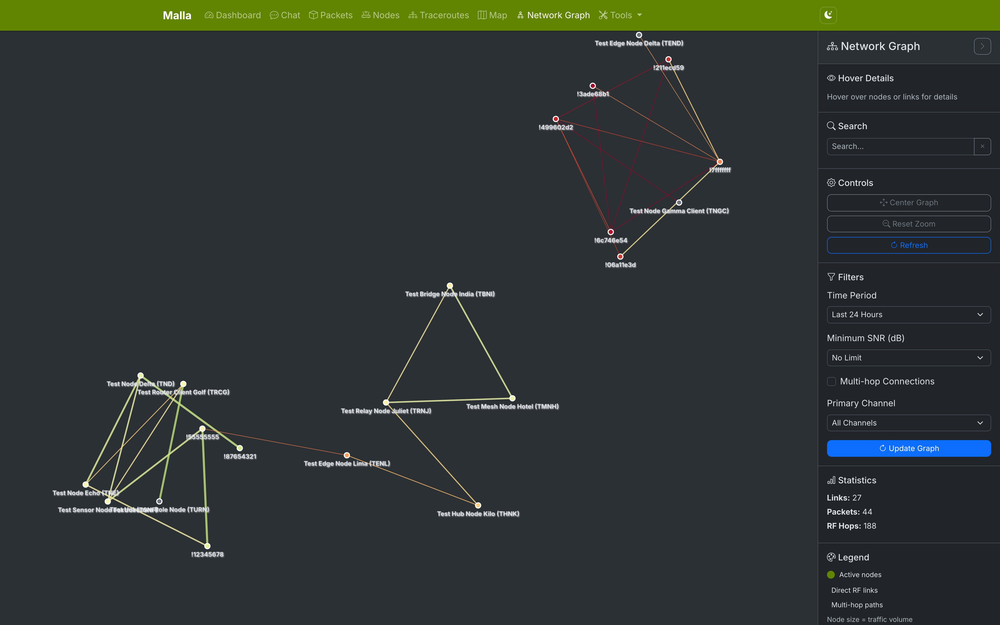
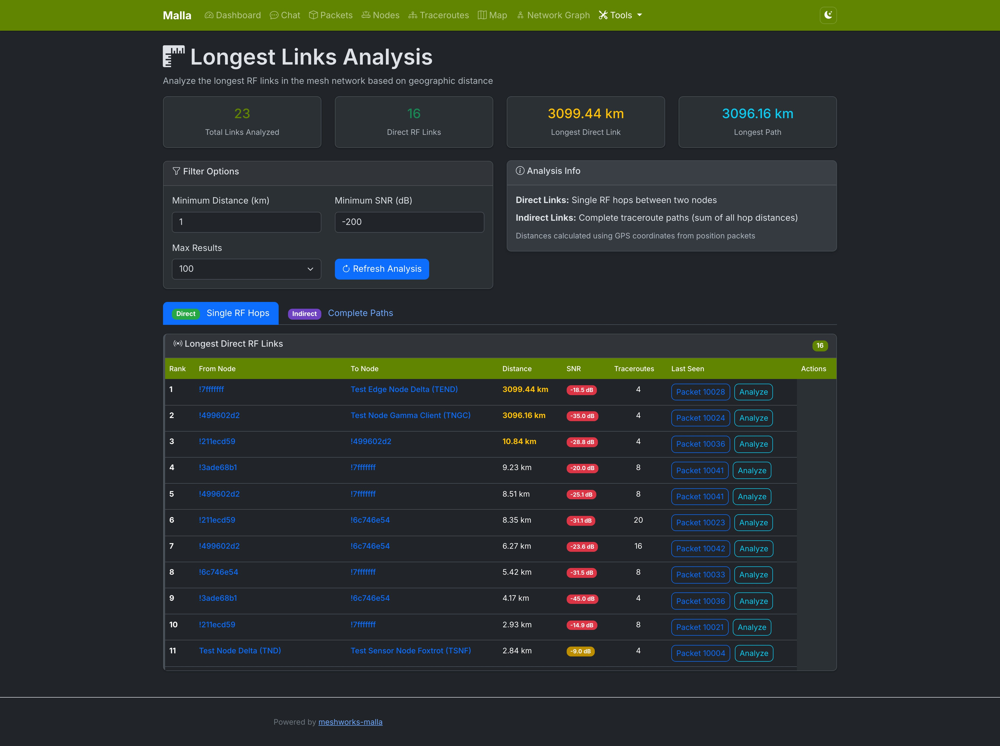

# Malla (Meshworks fork)

Malla (_Mesh_, in Spanish) is an ([AI-built](./AI.md)) tool that logs Meshtastic packets from an MQTT broker into a SQLite database and exposes a web UI to explore and monitor the network.  
This repository is Meshworks' maintained fork of [zenitraM/malla](https://github.com/zenitraM/malla) and powers the monitoring stack behind [meshworks.ru](https://meshworks.ru/).

> **Heads-up:** we do **not** publish container images for this fork.  
> Build the Docker image locally (instructions below) before running with Docker Compose.

## Running instances

Meshworks operates a public deployment backed by this fork:
- https://malla.meshworks.ru/ (Russia / Moscow mesh)

Community-operated upstream instances such as https://malla.meshtastic.es/ may run different code; feature parity is not guaranteed.

## Meshworks-specific enhancements

In addition to staying close to upstream, this fork ships Meshworks-focused improvements:

- Hardened chat experience with filterable live stream, adaptive tooltips and extensive end-to-end tests.
- Dark-mode aligned UI assets and Playwright-based screenshot tooling (`scripts/generate_screenshots.py`).
- Deterministic demo database generator for docs/tests via `scripts/create_demo_database.py`.
- Continuous integration coverage for Python 3.13 + Playwright, matching our production stack.
- Infrastructure docs and GitOps alignment for the Meshworks Meshtastic deployment.

Wherever possible we keep changes compatible so upstream updates remain easy to merge.

## Features

### 🚀 Key Highlights

• **End-to-end capture** – Logs every packet from your Meshtastic MQTT broker straight into an optimised SQLite database.

• **Live dashboard** – Real-time counters for total / active nodes, packet rate, signal quality bars and network-health indicators (auto-refresh).

• **Packet browser** – Lightning-fast table with powerful filtering (time range, node, port, RSSI/SNR, type), pagination and one-click CSV export.

• **Live chat stream** – Real-time view of decoded text (`TEXT_MESSAGE_APP`) messages with channel-aware filtering.

• **Node explorer** – Detailed hardware, role, battery and signal info for every node – searchable picker plus online/offline badges.

• **Traceroutes** – Historical list view to inspect packet paths across the mesh network.

• **Map view** – Leaflet map with live node locations, RF-link overlays and role colour-coding.

• **Network graph** – Force-directed graph visualising multi-hop links and RF distances between nodes / gateways.

• **Toolbox** – Hop-analysis tables, gateway-compare matrix and "longest links" explorer for deep dives.

• **Analytics charts** – 7-day trends, RSSI distribution, top talkers, hop distribution and more (Plotly powered).

• **Single-source config** – One `config.yaml` (or `MALLA_*` env-vars) drives both the capture tool and the web UI.

• **One-command launch** – `malla-capture` and `malla-web` wrapper scripts get you up and running in seconds.

<!-- screenshots:start -->









<!-- screenshots:end -->

## Prerequisites

- Python 3.13+
- Access to a Meshtastic MQTT broker
- Modern web browser with JavaScript enabled

## Installation

### Using Docker (build locally)

There is no public container image for this fork. Build it locally and point Docker Compose at the result.

1. **Clone this repository** and copy the sample environment:
   ```bash
   git clone https://git.meshworks.ru/MeshWorks/meshworks-malla.git
   cd meshworks-malla
   cp env.example .env
   ```

2. **Adjust configuration** (MQTT settings, instance name, etc.):
   ```bash
   $EDITOR .env
   ```

3. **Build the image** (single-arch example shown):
   ```bash
   docker build -t meshworks/malla:local .
   ```
   For multi-arch builds use BuildKit, for example:
   ```bash
   docker buildx build --platform linux/arm64,linux/amd64 \
     -t meshworks/malla:local --load .
   ```

4. **Run with Docker Compose**:
   ```bash
   export MALLA_IMAGE=meshworks/malla:local
   docker compose up -d
   ```
   The compose file ships with a pre-wired capture + web pair. Set MQTT credentials in `.env` before starting.

5. **Inspect logs / stop the stack**:
   ```bash
   docker compose logs -f
   docker compose down
   ```

**Manual Docker run (advanced):**
```bash
# Shared volume for the SQLite database
docker volume create malla_data

# Capture worker
docker run -d --name malla-capture \
  -e MALLA_MQTT_BROKER_ADDRESS=your.mqtt.broker.address \
  -e MALLA_DATABASE_FILE=/app/data/meshtastic_history.db \
  -v malla_data:/app/data \
  meshworks/malla:local \
  /app/.venv/bin/malla-capture

# Web UI
docker run -d --name malla-web \
  -p 5008:5008 \
  -e MALLA_DATABASE_FILE=/app/data/meshtastic_history.db \
  -e MALLA_HOST=0.0.0.0 \
  -e MALLA_PORT=5008 \
  -v malla_data:/app/data \
  meshworks/malla:local \
  /app/.venv/bin/malla-web
```

### Using uv

You can also install and run this fork directly using [uv](https://docs.astral.sh/uv/):
1. **Clone the repository** (Meshworks fork):
   ```bash
   git clone https://git.meshworks.ru/MeshWorks/meshworks-malla.git
   cd meshworks-malla
   ```

2. **Install uv** if you do not have it yet:
   ```bash
   curl -LsSf https://astral.sh/uv/install.sh | sh
   ```

3. **Create a configuration file** by copying the sample file:
   ```bash
   cp config.sample.yaml config.yaml
   $EDITOR config.yaml  # tweak values as desired
   ```

4. **Install dependencies** (development extras recommended):
   ```bash
   uv sync --dev
   playwright install chromium --with-deps
   ```

5. **Start it** with `uv run` in the project directory, which pulls the required dependencies automatically.
   ```bash
   # Start the web UI
   uv run malla-web

   # Start the MQTT capture tool
   uv run malla-capture
   ```

### Using Nix
The project also comes with a Nix flake and a devshell - if you have Nix installed or run NixOS it will set up
`uv` for you together with the exact system dependencies that run on CI (Playwright, etc.):

```bash
nix develop --command uv run malla-web
nix develop --command uv run malla-capture
```

## Quick Start

The system consists of two components that work together:

### 1. MQTT Data Capture

This tool connects to your Meshtastic MQTT broker and captures all mesh packets to a SQLite database. You will need to configure the MQTT broker address in the `config.yaml` file (or set the `MALLA_MQTT_BROKER_ADDRESS` environment variable) before starting it. See [Configuration Options](#configuration-options) for the entire set of settings.

```yaml
mqtt_broker_address: "your.mqtt.broker.address"
```

You can use this tool with your own MQTT broker that you've got your own nodes connected to, or with a public broker if you've got permission to do so.

**Start the capture tool:**
```bash
uv run malla-capture
```

### 2. Web UI

The web interface for browsing and analyzing the captured data.

**Start the web UI:**
```bash
uv run malla-web
```

**Access the web interface:**
- Local: http://localhost:5008

## Demo data & docs tooling

- Generate a reproducible demo database for local testing or screenshots:
  ```bash
  uv run python scripts/create_demo_database.py --output demo.db
  ```
  Point `MALLA_DATABASE_FILE` to the generated file to explore the sample data set.

- Refresh README screenshots after UX changes:
  ```bash
  uv sync --dev                   # ensure Playwright + deps are installed
  playwright install chromium --with-deps
  uv run python scripts/generate_screenshots.py
  ```
  The helper spins up a temporary Flask server using the demo fixtures, captures high-DPI screenshots, and rewrites the `<!-- screenshots:start --> ... <!-- screenshots:end -->` block automatically.

## Running Both Tools Together

For a complete monitoring setup, run both tools simultaneously:

**Terminal 1 - Data Capture:**
```bash
export MALLA_MQTT_BROKER_ADDRESS="127.0.0.1"  # Replace with your broker
./malla-capture
```

**Terminal 2 - Web UI:**
```bash
./malla-web
```

Both tools use the same SQLite database concurrently using thread-safe connections.

## Development workflow & pre-push checklist

- `uv sync --dev` to install all developer dependencies (Playwright, pytest, linting).
- `playwright install chromium --with-deps` once per workstation/CI runner.
- `pytest` (or `uv run pytest`) – the full suite includes integration + Playwright e2e coverage.
- `ruff check src tests` and `basedpyright src` for static analysis (see `make lint`).
- `uv run python scripts/generate_screenshots.py` when UI changes affect README imagery.
- `docker build -t meshworks/malla:local .` to ensure the container build path stays green.

Make sure these steps stay green before opening a PR or pushing to the deployment branch.

## Docker Configuration

When using Docker, configuration is handled through environment variables defined in your `.env` file:

### Production Deployment with Gunicorn

For production deployments, Malla supports running with Gunicorn, a production-ready WSGI server that provides better performance and stability than Flask's development server.

**Option 1: Using environment variable (recommended)**
```bash
# In your .env file:
MALLA_WEB_COMMAND=/app/.venv/bin/malla-web-gunicorn
```

**Option 2: Using the production override file**
```bash
docker-compose -f docker-compose.yml -f docker-compose.prod.yml up -d
```

**Option 3: Direct script execution**
```bash
# For local development with uv:
uv run malla-web-gunicorn

# Or using the executable script:
./malla-web-gunicorn
```

The Gunicorn configuration automatically:
- Uses multiple worker processes based on CPU cores
- Enables proper logging and monitoring
- Configures appropriate timeouts and connection limits
- Provides better concurrent request handling

**Benefits of Gunicorn over Flask dev server:**
- Production-ready with proper process management
- Better performance under load
- Automatic worker process recycling
- Proper signal handling for graceful shutdowns
- Enhanced logging and monitoring capabilities

### Environment File Setup
1. **Copy the example:**
   ```bash
   cp env.example .env
   ```

2. **Configure your settings:**
   ```bash
   # Required: Set your MQTT broker address
   MALLA_MQTT_BROKER_ADDRESS=your.mqtt.broker.address

   # Optional: Customize other settings
   MALLA_NAME=My Malla Instance
   MALLA_WEB_PORT=5008
   MALLA_SECRET_KEY=your-production-secret-key
   ```

### Key Configuration Options
- `MALLA_MQTT_BROKER_ADDRESS`: Your MQTT broker IP/hostname (**required**)
- `MALLA_MQTT_PORT`: MQTT broker port (default: 1883)
- `MALLA_MQTT_USERNAME`/`MALLA_MQTT_PASSWORD`: MQTT authentication (optional)
- `MALLA_WEB_PORT`: Port to expose the web UI (default: 5008)
- `MALLA_NAME`: Display name in the web interface

### Data Persistence
Data is automatically stored in a Docker volume (`malla_data`) and persists across container restarts. No manual volume setup is required when using `docker-compose`.

## Configuration Options

### YAML configuration file *(recommended)*

Malla will automatically look for a file named `config.yaml` in the **current
working directory** when it starts.  You can point to an alternative file by
setting the `MALLA_CONFIG_FILE` environment variable.

If the file is not found, all built-in defaults are used (see
`config.sample.yaml`).

Copy the sample file and customise it:

```bash
cp config.sample.yaml config.yaml
$EDITOR config.yaml  # tweak values as required
```

The file is **git-ignored** so you will never accidentally commit secrets such
as your `secret_key`.

The following keys are recognised:

| YAML key        | Type   | Default                                  | Description                                   | Env-var override |
| --------------- | ------ | ---------------------------------------- | --------------------------------------------- | ---------------- |
| `name`          | str    | `"Malla"`                                | Display name shown in the navigation bar.     | `MALLA_NAME` |
| `home_markdown` | str    | `""`                                     | Markdown rendered on the dashboard homepage.  | `MALLA_HOME_MARKDOWN` |
| `secret_key`    | str    | `"dev-secret-key-change-in-production"` | Flask session secret key (change in prod!). (currently unused)   | `MALLA_SECRET_KEY` |
| `database_file` | str    | `"meshtastic_history.db"`                | SQLite database file location.                | `MALLA_DATABASE_FILE` |
| `host`          | str    | `"0.0.0.0"`                              | Interface to bind the web server to.          | `MALLA_HOST` |
| `port`          | int    | `5008`                                   | TCP port for the web server.                  | `MALLA_PORT` |
| `debug`         | bool   | `false`                                  | Run Flask in debug mode (unsafe for prod!).   | `MALLA_DEBUG` |
| `mqtt_broker_address` | str | `"127.0.0.1"`                      | MQTT broker hostname or IP address.           | `MALLA_MQTT_BROKER_ADDRESS` |
| `mqtt_port`     | int    | `1883`                                   | MQTT broker port.                              | `MALLA_MQTT_PORT` |
| `mqtt_username` | str    | `""`                                     | MQTT broker username (optional).               | `MALLA_MQTT_USERNAME` |
| `mqtt_password` | str    | `""`                                     | MQTT broker password (optional).               | `MALLA_MQTT_PASSWORD` |
| `mqtt_topic_prefix` | str | `"msh"`                                 | MQTT topic prefix for Meshtastic messages.    | `MALLA_MQTT_TOPIC_PREFIX` |
| `mqtt_topic_suffix` | str | `"/+/+/+/#"`                           | MQTT topic suffix pattern.                     | `MALLA_MQTT_TOPIC_SUFFIX` |
| `default_channel_key` | str | `"1PG7OiApB1nwvP+rz05pAQ=="`         | Default channel key for decryption (base64).  | `MALLA_DEFAULT_CHANNEL_KEY` |

Environment variables **always override** values coming from the YAML file.

## Contributing

Feel free to submit issues, feature requests, or pull requests to improve Malla!

## License

This project is licensed under the [MIT](LICENSE) license.
